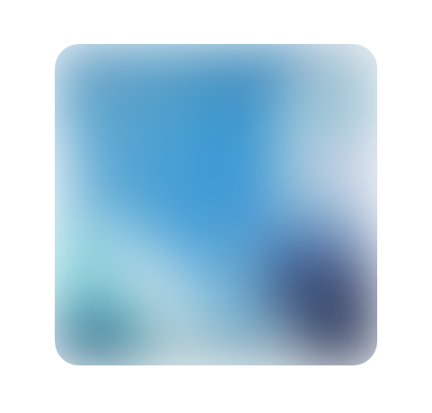

# vue-frosted-glass



## Usage

```sh
npm install vue-frosted-glass
```

**notice**
|属性|描述|值类型|默认|
|---|---|---|---|
|background-image|背景|等同于`css` `background-image`|-|
|filter|filter|等同于`css` `filter`|`blur(36px)`|

```vue
<template>
  <div class="home">
    
    <h1>Default</h1>
    <FrostedGlass background-image="url(/assets/bg-1.png)" />
    <h1>Slot</h1>
    <FrostedGlass background-image="url(/assets/bg-1.png)">
      <h2>Hello world</h2>
    </FrostedGlass>
    <h1>Inline-block</h1>
    <FrostedGlass background-image="url(/assets/bg-1.png)" class="inline-block">
      <h2>Hello world</h2>
    </FrostedGlass>
  </div>
</template>

<script>
import FrostedGlass from "vue-frosted-glass";
import "vue-frosted-glass/dist/VueFrostedGlass.css";

export default {
  name: "Home",
  components: {
    FrostedGlass
  }
};
</script>

<style lang="stylus" scoped>
.inline-block {
  display: inline-block;
  width: 400px;
  height: 400px;
  border-radius: 1em;
}
</style>
```

## LICENSE

MIT
